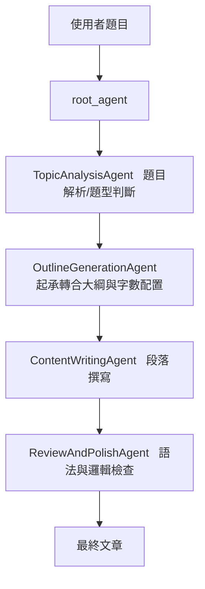
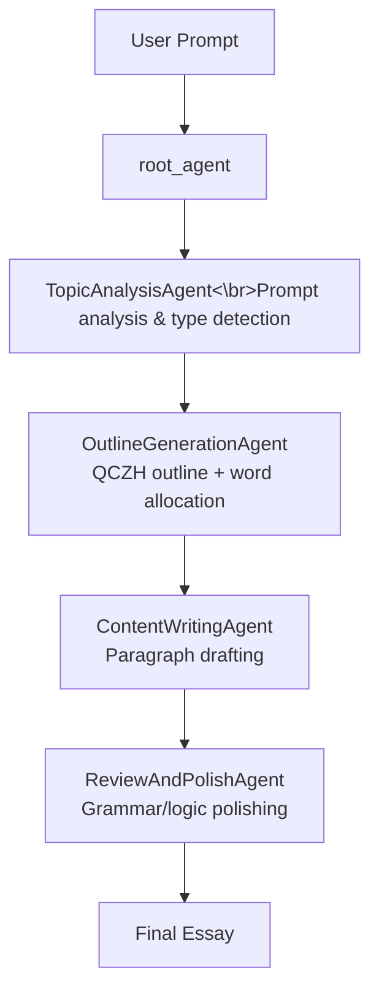

# Essay_Writer Readme / 專案說明

## 繁體中文版本
For English version READ_ME, please see bellow.

### 問題與目標
國家考試作文需在有限時間內完成具結構、字數與論點要求的文章。Essay_Writer 透過多代理協作，自動拆解題目、產出大綱與內容，減少準備時間並提升品質。

### 解決方案摘要
主代理 `root_agent` 依序呼叫四個子代理：題目分析、大綱生成、內容撰寫、審核潤飾。流程保證文章符合「起、承、轉、合」結構、字數限制（700 字內）與語氣設定（口語化）。

### 架構圖


### 系統需求
- Python 3.10 以上
- 依賴套件：`google-adk`、`python-dotenv`
- 執行環境需具備 Google ADK 模型授權，並設定 `GOOGLE_API_KEY`（或依所使用的憑證方式調整）。

### 安裝與環境設定
1. 建議在虛擬環境中安裝：
   ```bash
   python -m venv .venv
   source .venv/bin/activate
   ```
2. 安裝相依套件：
   ```bash
   pip install -r requirements.txt
   ```
3. 設定模型與 API 金鑰（可選但建議）：在專案根目錄新增 `.env` 檔，例如：
   ```env
   MODEL=gemini-2.5-flash
   GOOGLE_API_KEY=<your_api_key>
   ```
   未設定 `MODEL` 時預設為 `gemini-2.5-flash`。

### 使用方式
1. 在程式中匯入並呼叫 `root_agent`：
   ```python
   from Essay_Writer.agent import root_agent

   prompt = "請以『科技與人性』為題撰寫國考作文"
   response = root_agent.run(prompt)
   print(response)
   ```
2. 若需客製模型，可在呼叫前修改環境變數或覆寫 `root_agent` 的配置。

### 資料夾與檔案架構
- `agent.py`：定義主代理 `root_agent` 及其工作流程。
- `sub_agents/`：子代理設定與提示詞。
  - `TopicAnalysisAgent/TopicAnalysisAgent.py`
  - `OutlineGenerationAgent/OutlineGenerationAgent.py`
  - `ContentWritingAgent/ContentWritingAgent.py`
  - `ReviewAndPolishAgent/ReviewAndPolishAgent.py`
- `requirements.txt`：套件需求列表。
- `evalset624398.evalset.json`：內含評估用題目範例。

---

## English Version

### Problem & Goal
Civil service–style essays must meet structural, length, and argumentation constraints within tight time limits. Essay_Writer breaks the work into agent steps—analysis, outlining, drafting, and polishing—to speed up preparation while maintaining quality.

### Solution Overview
The `root_agent` orchestrates four sub-agents in sequence: topic analysis, outline generation, content drafting, and review/polish. The pipeline enforces a clear “qi-cheng-zhuan-he” narrative flow, keeps the essay under 700 Chinese characters, and maintains a conversational tone.

### Architecture Diagram


### Prerequisites
- Python 3.10+
- Dependencies: `google-adk`, `python-dotenv`
- Runtime must have Google ADK model access; set `GOOGLE_API_KEY` (or equivalent credential setup).

### Setup & Environment
1. (Recommended) create and activate a virtual environment:
   ```bash
   python -m venv .venv
   source .venv/bin/activate
   ```
2. Install dependencies:
   ```bash
   pip install -r requirements.txt
   ```
3. Configure the model and API key (recommended) via a `.env` file:
   ```env
   MODEL=gemini-2.5-flash
   GOOGLE_API_KEY=<your_api_key>
   ```
   If `MODEL` is omitted, the default is `gemini-2.5-flash`.

### How to Use
1. Import and run `root_agent` from your code:
   ```python
   from Essay_Writer.agent import root_agent

   prompt = "Write a civil service exam essay on 'Technology and Humanity'"
   response = root_agent.run(prompt)
   print(response)
   ```
2. To use a different model, adjust environment variables or override the configuration before calling `run`.

### Repository Layout
- `agent.py`: defines the `root_agent` and its workflow configuration.
- `sub_agents/`: sub-agent definitions and prompt templates.
  - `TopicAnalysisAgent/TopicAnalysisAgent.py`
  - `OutlineGenerationAgent/OutlineGenerationAgent.py`
  - `ContentWritingAgent/ContentWritingAgent.py`
  - `ReviewAndPolishAgent/ReviewAndPolishAgent.py`
- `requirements.txt`: dependency list.
- `evalset624398.evalset.json`: sample prompts for evaluation.
